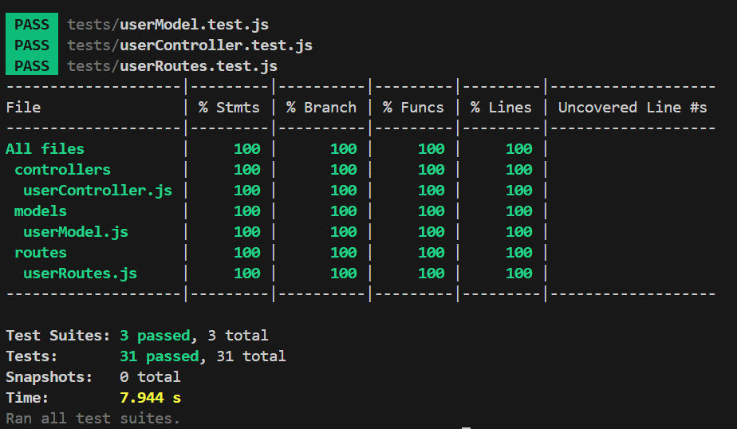

# PRINCIPAIS DICAS PARA A PARTE PRÁTICA DA PROVA DO MÓDULO 2
- Verificar nome de funções assíncronas do model e do controller, ou seja, se correspondem aos colocados nos arquivos userController.js e userModel.js. No model, no controller e especialmente no userController.test.js algumas funções assíncronas estavam sendo chamadas com o nome errado; 

- Verificar o nome dos arquivos e ver se eles estão sendo importados com o nome certo (ex.: não tem como importar um arquivo userService.js se ele não existe);

- Verificar se a sintaxe SQL está correta no model (SELECT * FROM, $1 etc);

- Verificar nomes de variáveis (se estão corretas);

- Verificar nome das rotas.
   

# PRINCIPAIS ARQUIVOS MODIFICADOS
- controllers/userController.js;
- models/userModel.js;
- tests/userController.test.js.
   

# SAÍDA ESPERADA APÓS RODAR O COMANDO NPM TEST NO TERMINAL
